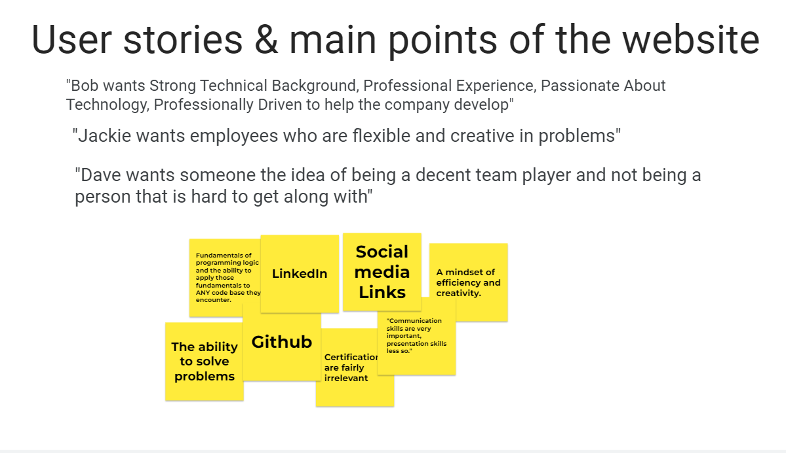
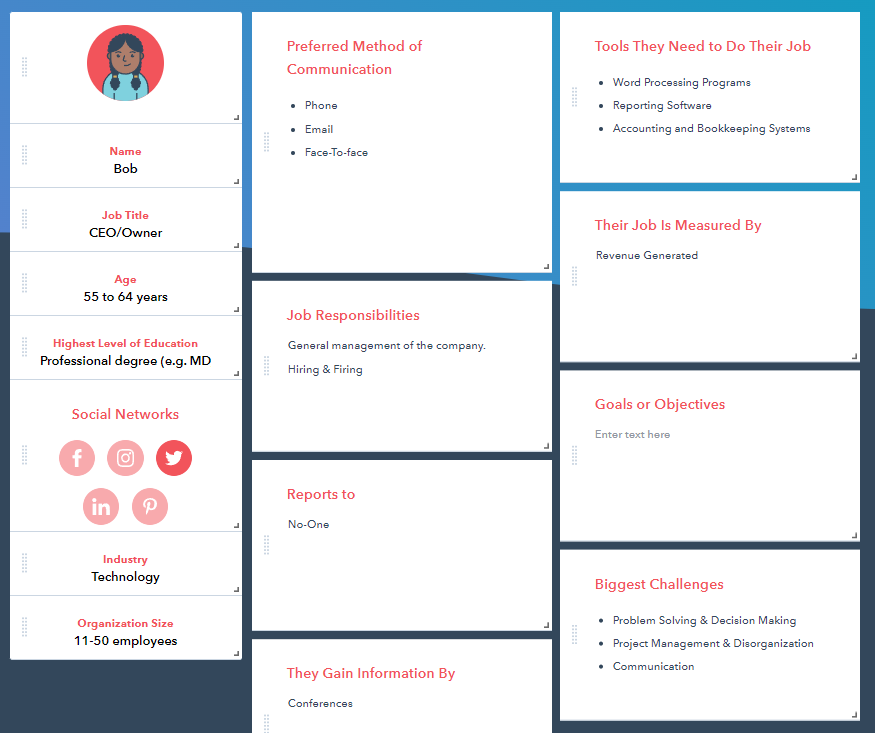
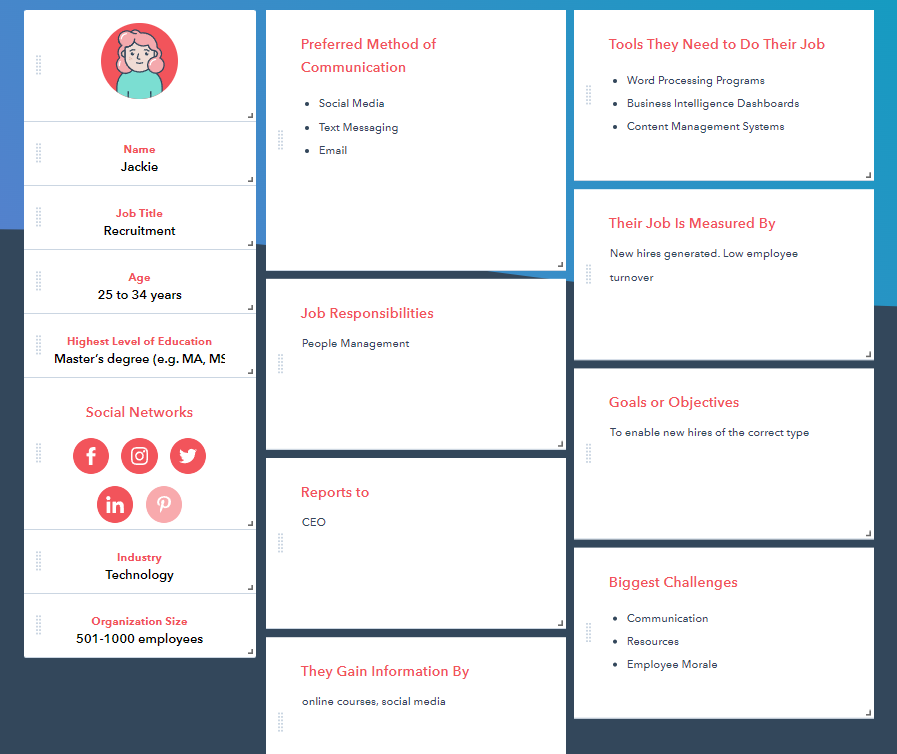
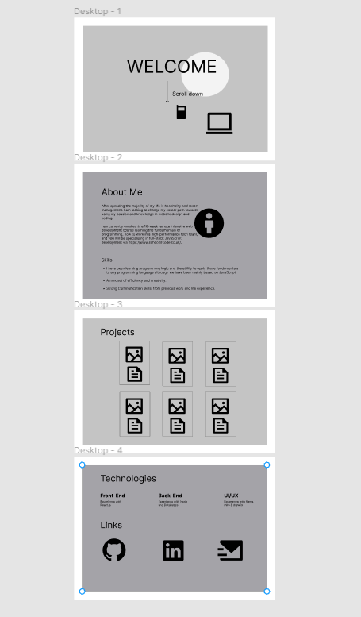
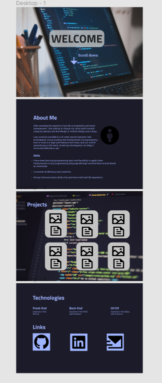

# Design for a portfolio website UI/UX planning project
## View the unfinished site [here](https://jojokcreator.github.io/Portfoliopage/)

## User Stories 
### Who will be using your app? What needs will this app fulfill? Add your user stories and personas to this repo.

 

## User flow Diagram
[Userflow](./planning_Stages/user_Journey_Flow.drawio)

## Wireframe -Miro

## High-fidelity design - Figma

